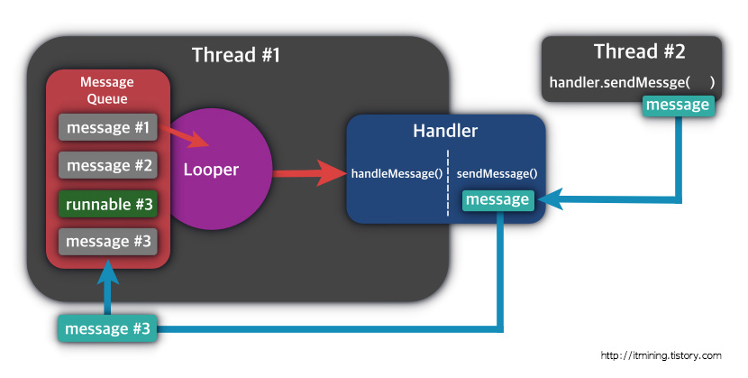

# 스레드와 루퍼

## 목차

- [메인 스레드](#메인-스레드란-무엇인가?)
    - [메인 스레드란 무엇인가?](#메인-스레드란-무엇인가?)
    - [메인 스레드 특징](#메인-스레드-특징)
    - [메인 스레드의 제약사항](#메인-스레드의-제약사항)
- [백그라운드 스레드](#백그라운드-스레드)
    - [Thread 객체를 상속받아서 스레드 생성](#Thread-객체를-상속받아서-스레드-생성)
    - [Runnable 인터페이스](#Runnable-인터페이스)
    - [람다식으로 Runnable 익명 객체 구현](#람다식으로-Runnable-익명-객체-구현)
    - [코틀린에서 제공하는 thread() 구현](#코틀린에서-제공하는-thread-구현)
- [메인 스레드와 백그라운드 스레드](#메인-스레드와-백그라운드-스레드)
- [핸들러와 루퍼](#핸들러와-루퍼)

## 메인 스레드(UI 스레드)

### 메인 스레드란 무엇인가?

안드로이드에서 메인 스레드는 UI 스레드로, 애플리케이션에서 사용자 입력이나 UI 업데이트를 담당하는 스레드입니다.

### 메인 스레드 특징

- 화면의 UI를 그립니다.
- 안드로이드 UI 툴킷의 구성요소(android,widget, android,view, ...)와 상호작용합니다.
- UI 이벤트를 사용자에게 응답해줍니다.

### 메인 스레드의 제약사항

- UI 이벤트나 작업이 몇 초 내에 응답하지 않으면 안드로이드 시스템은 ANR(응용 프로그램이 응답하지 않음)이 표시됩니다.
  따라서 시간이 오래 걸리는 작업은 새로운 스레드를 생성해서 처리해야 합니다.
- 즉, UI 이벤트나 작업이 오래 걸리면 프로그램이 죽기 때문에 스레드를 새로 만들어서 처리해야 프로그램이 죽지 않습니다.

## 백그라운드 스레드

메인 스레드가 아닌 뒤쪽에서 별도로 실행되는 스레드입니다.

백그라운드 스레드는 네트워크 작업이나 오래 걸리는 계산, 파일 다운로드, 업로드와 같이 시간을 계산할 수 없는

오래 걸리는 작업에 대해서 처리하는 것을 권장합니다. 만약 메인 스레드가 이러한 오래 걸리는 작업을 수행하면

ANR이 발생할 것입니다.

### Thread 객체를 상속받아서 스레드 생성

다음과 같이 Thread 클래스를 상속받아서 스레드를 생성할 수 있습니다.

```kotlin
class WorkerThread : Thread() {
    override fun run() {
        var i = 0
        while (i < 10) {
            i += 1
            Log.i("WorkerThread", "$i")
        }
    }
}
```

다음과 같이 스레드 객체인 WorkerThread 객체를 생성하여 시작할 수 있습니다.

```kotlin
ovveride fun onCreate(savedInstanceState: Bundle?) {
    super.onCreate(savedInstanceState)
    setContentView(R.layout.activity_main)

    var thread = WorkerThread()
    thread.start()
}
```

### Runnable 인터페이스

Runnable 인터페이스를 구현하여 스레드를 생성할 수 있습니다.

Runnable 인터페이스를 지원하는 이유는 코틀린에서는 다중 상속이 불가능하기 때문에 상속 관계에 있는 클래스에

인터페이스를 구현하여 스레드를 생성하기 위함입니다.

```kotlin
class WorkerRunnable : Runnable {
    override fun run() {
        var i = 0
        while (i < 10) {
            i += 1
            Log.i("WorkerThread", "$i")
        }
    }
}
```

```kotlin
ovveride fun onCreate(savedInstanceState: Bundle?) {
    super.onCreate(savedInstanceState)
    setContentView(R.layout.activity_main)

    var thread = Thread(WorkerRunnable())
    thread.start()
}
```

### 람다식으로 Runnable 익명 객체 구현

인터페이스 내부에 메서드가 하나만 있는 경우 람다식으로 변환이 가능합니다.

```kotlin
Thread {
    var i = 0
    while (i < 10) {
        i += 1
        Log.i("WorkerThread", "$i")
    }
}.start()
```

### 코틀린에서 제공하는 thread 구현

코틀린에서는 백그라운드를 사용할 수 있습니다.

thread() 안에 파라미터로 start=true를 전달하면 thread() 안의 코드 블럭이 실행됩니다.

```kotlin
thread(start = true) {
    var i = 0
    while (i < 10) {
        i += 1
        Log.i("WorkerThread", "$i")
    }
}
```

## 메인 스레드와 백그라운드 스레드

안드로이드에서 '백그라운드 스레드'는 UI 구성 요소에 접근하면 안된다는 규칙이 있습니다.

```kotlin
override fun onCreate(savedInstanceState: Bundle?) {
    super.onCreate(savedInstanceState)
    setContentView(R.layout.activity_main)

    Thread {
        var i = 0
        while (i < 10) {
            textView.text = "$i"
            i += 1
            Thread.sleep(1000)
        }
    }.start()
}
```

위 코드는 activity_main.xml에 텍스트뷰를 하나 만든 후 백그라운드 스레드에서 이 텍스트뷰를 1초마다 한번씩 값을 입력하는

코드를 실행하면 FATAL EXCEPTION 예외를 발생시키고 앱을 종료합니다.

**발생한 이유는 메인 스레드 이외의 스레드는 UI를 업데이트 할 수 없습니다.**

## 핸들러와 루퍼

메인 스레드와 백그라운드 스레드 및 스레드 간의 통신을 위해서 **핸들러와 루퍼**를 제공합니다.

### 핸들러와 루퍼 작동 원리

1. 메인 스레드는 내부적으로 **루퍼**를 가지며 루퍼는 **Message Queue**를 포함합니다.
2. **Message Queue**는 다른 스레드 혹은 스레드 자기 자신으로부터 전달받은 메시지를 보관하는 Queue입니다.
3. 루퍼는 Message Queue에서 메시지, Runnable 객체를 차례로 꺼내서 한들러가 처리하도록 전달합니다.
4. 핸들러는 루퍼로부터 받은 메시지, Runnable 객체를 처리하거나 메시지를 받아서 Message Queue에 넣는 스레드간의 통신장치입니다.



### 루퍼

루퍼는 MainActivity가 실행되면 동시에 for문 하나가 무한루프를 돌고 있는 서브 스레드

**루퍼는 대기하고 있다가 자신의 큐인 메시지 큐에 메시지를 핸들러에 전달합니다.**

즉, 루퍼는 메시지 큐를 가지고 메시지 큐에서 메시지를 꺼내서 핸들러에게 전달하는 백그라운드 스레드입니다.

### 핸들러

핸들러는 루퍼를 통해 받은 메시지를 처리하는 역할입니다.

핸들러는 루퍼가 있는 메인 스레드에서 주로 사용됩니다.

스레드들과 메인 스레드와의 통신을 담당합니다.

**루퍼는 앱이 실행되면 자동으로 하나 생성되어 무한 루프를 돌고 있지만 핸들러는 개발자가 명시적으로 생성해야 합니다.**

### 메시지

메시지는 루퍼의 큐에 값을 전달하기 위해 사용되는 객체입니다.

메시지 객체에 미리 정의해둔 코드를 입력하고, 큐에 담아두면 루퍼가 꺼내서 핸들러에 전달합니다.


